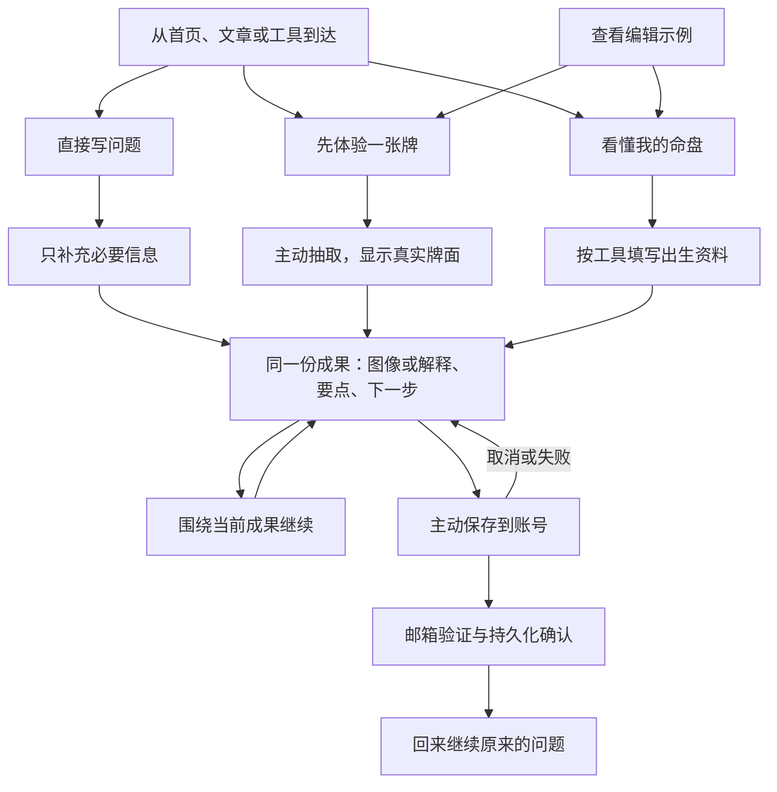

# Wenbu 下一阶段体验研究：让一次探索成为可继续使用的成果

日期：2026-10-06（Asia/Shanghai）。状态：**研究与设计建议，尚未实施或部署**。源码基线：`2426d4ddefe4ddb4dea3845c91b097b81b42dff8`。这是第一阶段上线后的重新检查，旧版本的连续问卷、空结果面板等历史问题不再直接作为本轮证据。

本轮重新操作线上首页、Agent、示例、真实抽牌解读、保存邀请、独立塔罗、八字与英文界面，保存了 [9 步、11 张新截图](../reviews/onboarding-next-2026-10-06/README.md)。另核对相关源码和受保护的生产聚合统计。没有招募真实用户，没有发送注册邮件，没有完成跨设备账号测试，也没有运行增长实验。浏览器中已有此前的测试会话，不能把本轮称为隔离的新访客实验。

## 1. 核心判断

下一轮应围绕一个明确的收获设计：**用户能很快开始，得到看得懂的结果，带着同一份结果继续、保存和回来。** Wenbu 的纸墨风格、原创牌面、免注册试用与结果后的邮箱保存已经构成良好基础；最需要改善的是这些能力之间的衔接。

本轮与上一阶段相比，发现了五个更具体的问题：

1. **新手入口可见性不足。** 中文 390×844 首屏完整显示前三张引导卡，第四张“从零入门”和“还没想好”需要滚动；英文 320×812 只完整显示前两张。需要帮助的人面对的入口反而在后面。
2. **示例到实践有断点。** 示例清楚、漂亮，但“开始我的问题”只是回到空输入框。用户看懂一份范例后，还要自己决定题目、方法和表达方式。
3. **图像与针对当前问题的解释分离。** 真实抽牌成功后，聊天给了绘画练习建议，结果面板只有牌面、关键词和通用反思。同一问题的完整成果散在两个地方。
4. **追问和保存没有充分接住具体结果。** 正文建议继续做一周练习清单，按钮却是“用白话讲讲这个结果”“接下来可以尝试什么”；保存弹层展示被截断的提问，没有清楚展示保存的牌与行动。
5. **实验的数据基础需要先校准。** 测试 Cookie 与前端事件标记存在代码层面的不一致；账号报表的最近 7 天队列也不适合直接计算成熟的 7 天转化。先纠正测量，再评价方案收益。

这些是“问题存在”的证据，不是线上发生频率或转化损失估计。一个成功模型样本也不能证明所有题型都稳定。

## 2. 本轮真实任务说明了什么

测试输入不含个人资料：

> 我第一次接触塔罗。请实际抽一张牌，帮我思考如何开始一直拖延的绘画练习。先解释画面，再给我今天能做的一小步。

Agent 没有前置问卷，调用工具抽出圣杯九正位，并给出“设 10 分钟，只画眼前一件物品”的具体行动。浏览器事件从 `agent_started` 到 `agent_received:complete` 相差 **4,854 毫秒**，两条均为 `test: true`。这是单次客户端完成时长，**不是首字时延、结果被看见的时长或性能分位数**。证据见 [trial-events.json](../reviews/onboarding-next-2026-10-06/trial-events.json)。

值得保留的行为：真实抽取、没有凭空补出生信息、没有强制注册、解释能落到实际行动。模型也说明自己未读取 Wenbu 原创插画，避免把传统牌面描述冒充实际看图。

仍需改进的行为：回答包含长段落；画面说明与能力局限占据较多空间；一周练习清单没有对应的快捷动作。最关键的是打开“探索结果”后，绘画建议没有一起出现。

源码解释了这个现象：[agent-deliverables.ts](../../src/lib/agent-deliverables.ts) 先返回已有 artifact，只有没有 artifact 的完成消息才派生文字结果。所以“纯文字答案可以回看”已改善，但“工具图像与同回合解释成为一份成果”尚未解决。它不是模型偶尔漏写报告那么简单。

另一次独立工具试用中，切换单张后成功抽出恶魔逆位。工具仍使用“哪张牌最让你在意”的多张通用文案。默认三张、包含逆位由 [ToolDesk.tsx](../../src/components/ToolDesk.tsx) 初始状态确认，不是仅凭已有浏览器偏好推断。

## 3. 研究依据与适用范围

以下为本轮重新查阅的原始研究、设计系统和官方产品说明。竞品部分是资料对照，没有把帮助中心当作竞品实操证据。

| 依据                                                                                                                                                                                          | 有用的结论                                                        | 对 Wenbu 的应用与边界                                                                            |
| --------------------------------------------------------------------------------------------------------------------------------------------------------------------------------------------- | ----------------------------------------------------------------- | ------------------------------------------------------------------------------------------------ |
| [NN/g：Prompt Suggestions，2025](https://www.nngroup.com/articles/prompt-suggestions/)                                                                                                        | 开场、输入建议和结果追问承担不同任务，提示要贴合当前情境          | 开场解决“不知如何开始”；结果按钮直接接住这次建议。增加按钮数量本身不是改善                       |
| [NN/g：Less Chat, More Answer，2026](https://www.nngroup.com/articles/less-chat-more-answer/)                                                                                                 | 9 人使用 8 个站点聊天机器人的研究强调具体、可扫描的答案和按需展开 | 第一层先给用户所需的答案与必要限定。命理反思也可能需要慢聊，不能把所有长对话视为失败             |
| [NN/g：New Users Need Support，2024](https://www.nngroup.com/articles/new-ai-users-onboarding/)                                                                                               | 新手需要理解能力和获得贴近任务的帮助                              | 不要求用户先学提示词；这不是 Wenbu 用户样本，也不提供本站增长预测                                |
| [GOV.UK：Question pages](https://design-system.service.gov.uk/patterns/question-pages/)                                                                                                       | 只问有明确用途的资料，允许有效的“不知道”，避免重复填写            | 八字日期、时间与时区合理成组；未知时间保留退路。不要机械地把每个字段拆成一轮聊天                 |
| [GOV.UK：Create accounts](https://design-system.service.gov.uk/patterns/create-accounts/)                                                                                                     | 需要账号前尽可能允许使用服务，降低建号负担                        | 保持游客完成体验；账号价值明确落在保存与继续使用                                                 |
| [Baymard：Delayed Account Creation，2023](https://baymard.com/research-articles/delayed-account-creation)                                                                                     | 电商研究中，主任务中途插入建号会干扰任务                          | 用作延后邀请的类比。其站点比例和电商结果不能变成 Wenbu 的注册提升预测                            |
| [Microsoft Research：Human-AI Interaction，2019](https://www.microsoft.com/en-us/research/articles/guidelines-for-human-ai-interaction-eighteen-best-practices-for-human-centered-ai-design/) | 说明能力和局限，支持纠正、退出及近期上下文                        | 在需要时解释为何补资料；错了可以改，停了能够继续；以实际能力描述研习范围                         |
| [Claude：Artifacts](https://support.claude.com/en/articles/17153992-what-are-artifacts-and-how-do-i-use-them)                                                                                 | 可复用成果可与对话并排查看、修改和再次打开                        | 用稳定的成果承接任务，不要求新手先理解多面板工作台；不照搬其功能门槛                             |
| [Google Notebook：Chat](https://support.google.com/gemininotebook/answer/16179559?hl=en)                                                                                                      | 来源可以回到原文，答复可保存为保留格式和引用的笔记                | 保存用户刚看到的内容，引用打开到正确依据。当前官方页面名为 Gemini Notebook                       |
| [W3C：Focus Not Obscured](https://www.w3.org/WAI/WCAG22/Understanding/focus-not-obscured-minimum.html)                                                                                        | 固定顶部、底部和弹层可能遮住键盘焦点                              | 对输入栏、结果页和邮箱弹层做真实键盘检查。截图不能证明 WCAG 合规，也不能把首屏折叠误称为焦点违规 |

## 4. 引导架构：按准备程度给入口

“工作、关系、自我、入门”是主题分类；用户最先需要解决的往往是“我是否有问题、是否想提供资料、能否先试一下”。建议首页与 Agent 用后者作为第一层，主题放到第二层或根据已输入内容选择。

图中为建议的承接关系，不增加强制入口选择页；首次短答、工具结果和研究报告仍有不同的完成条件。

### 4.1 三条可以直接开始的路径

| 用户状态       | 入口候选       | 点击后发生什么                                                 | 最少输入                         | 初次完成应得到什么                   |
| -------------- | -------------- | -------------------------------------------------------------- | -------------------------------- | ------------------------------------ |
| 有问题         | 写下你在意的事 | 保持输入为主；一句话也能发出                                   | 一个问题                         | 相关要点、未知信息与下一步           |
| 没准备，想先试 | 先体验一张牌   | 明示“真实随机抽一张，正位阅读，无需生日”；确认动作就是抽牌按钮 | 可不填写                         | 真实牌面、简明牌义、一个可做的小练习 |
| 想看个人命盘   | 看懂我的命盘   | 展开当前工具必需字段；说明为什么需要                           | 日期、出生地时区；八字时间可未知 | 命盘和“先看这一处”的短解释           |

这是三种直接操作，不另加一页强制“选择你的身份”。已有具体输入、来自具体知识文章或工具页面的人，保持原来的任务路径。独立四工具继续保留。

“先体验一张牌”的第一份结果可由现有计算工具与核对过的牌义组成，不需要一次模型问卷。用户想结合情况再聊时，明确分享该牌与自己输入的问题，复用当前抽取结果。不要为了继续对话再次抽牌。

初学者入口采用单张正位是降低学习负担的**产品默认建议**，不是认定逆位不正确。完整工具保留三张、逆位及说明；已发生的抽取不改变方向，用户选择不能被静默重置。结果中的单复数文案必须随牌数变化。

### 4.2 让示例自然接到实践

示例继续明确标注“编辑示例，非个人结果”。保留“开始我的问题”，并增加与示例对应的操作：

- 塔罗示例：**自己抽一张试试**。先说明将真实随机抽取；不把固定星星牌伪装成用户抽到的牌。
- 命盘示例：**用我的出生资料试试**。示范日期不能残留在个人资料里；不知道时间可明确选择未知。
- 有依据的解释：**问一个相关问题**。给 2 个有实际内容的选项，例如“零点和子初换日有什么差别”；点击发送的文字与看见的文字一致。

手机端在示例标题附近也提供轻量的实践入口，正文结尾再出现完整动作，不必为了继续而先读到底。返回后保留原输入草稿，仍不把表单答案复制进输入框等待用户再发送。

### 4.3 选择题只负责减少表达负担

每次最多呈现 2–4 个容易区分的选项，允许“暂不确定”和自由输入。相关事实一次补充；可选偏好遵守已上线的一次澄清约束。选项应说明动作或答案，不暗含未经用户说出的职业、关系或情绪事实。

例如用户说“最近有些纠结”：可以问“先梳理一件事，还是先做一次不需资料的体验？”；用户说“解释八字里的日主”：直接解释，不再问更喜欢历史还是应用。用户给出完整事实时不强行触发新手流程。

## 5. 结果架构：同一份成果贯穿对话、保存和回访

### 5.1 一张成果卡需要哪些内容

| 层级       | 内容                                 | 本轮绘画试用的示例                                       |
| ---------- | ------------------------------------ | -------------------------------------------------------- |
| 任务       | 简短标题与用户原问题入口             | 开始拖延已久的绘画练习                                   |
| 实际结果   | 牌面 / 命盘 / 卦象 / 核实过的解释    | 圣杯九 · 正位，实际抽取                                  |
| 第一层解释 | 一句重点、至多三项要点，必要局限可见 | 把完成一次练习作为今天的目标；牌不能判断你的实际拖延原因 |
| 行动       | 一个能执行的小步骤                   | 选眼前物品，画 10 分钟                                   |
| 深入       | 原始完整答复、算法约定、来源、版本   | 展开原文；查看抽牌规则和牌义                             |
| 继续       | 与当前结果一致的 1–2 个动作          | 制定一周练习；把今天的一步再缩小                         |
| 留存       | 真实保存状态与用户主动动作           | 保存这次探索；继续而不保存                               |

示例文字是设计稿，不冒充新的模型结果。短版不能去掉“不知道、未核实、仅作反思”等会改变意思的限定，也不能把“猜测原因”写成用户心理事实。

短期实现先解决结构缺口：同一回合的图像 artifact 与原文答案一起可读，保持一个明确的回合关联，不重复调用模型生成“摘要的摘要”。移动端在聊天中展示小型成果卡，点击进入完整同一份结果；桌面可以继续保留侧栏。

第二步再增加受校验的输出结构，例如任务标题、关键解释、下一步、必要限定、已验证来源 ID。正文与结构应来自同一次生成或确定性的原文视图，保留原始回复。结构无效时使用清楚标明的原文回退，不截断到可能改变含义，不隐藏错误后假称完成。

`>= 80` 字符只是当前 [agent-deliverables.ts](../../src/lib/agent-deliverables.ts) 的“可展示结果”代理条件，不能判断有用性。简短、直接的事实答复也可能有用；冗长泛泛的回答也可能没有完成任务。新的完成状态应看当前任务所需内容是否齐全。

### 5.2 保存的是成果，继续的是同一个问题

建议内部关联 `taskId / turnId / artifactIds / answerMessageId / revision / saveState`，在同一任务中保留各次修订，界面优先展示当前成果。这里只是设计建议，不声称现有生产协议已支持这些字段。

“解释这张牌”“继续排一周练习”默认携带用户明确选择的现有结果，不重新随机、不遗失原来的约定。工具跳到 Agent 时显示“将带入：这张牌、抽取规则、你的问题”；出生资料、旧会话和日志不因跳转被整体发送。个人上下文不放进 URL。分享对外公开是另一种动作，不能与私人保存混在一起。

### 5.3 让原创图像真正参与解释

本轮模型诚实说明它看不到原创牌面的细节，这个边界应保留。同时可以为牌面建立经过核对的中英文描述：可见人物、物件、构图、与传统图像不同之处、适当的替代文本。先抽查 10 张不同类型，再逐步覆盖 78 张。

描述必须对着实际插画核对，不能只搬通行 Rider–Waite 文本。把已核对的简短描述作为工具结果提供给模型后，才允许它解释“本张画面”。传统牌义、实际图像事实和个人联想仍需区分。

## 6. 注册、试用额度与回访

### 6.1 保持当前注册时机，改进注册收益的可见性

本轮保存弹层的方向正确：主动点击之后出现，只有邮箱，说明验证即建号、不订阅推广邮件，取消后原结果仍在。不应因为样本少就把注册门槛提前。

建议将弹层中的长提问预览改为“**开始绘画练习 · 圣杯九正位 · 对话与行动清单**”之类的真实内容摘要，并显示保存范围。验证成功与保存成功分开处理：先等账号确认，再等服务端持久化确认，最后显示“已保存到账号”。保存失败保留结果和重试；取消回到原位置。

| 情境                           | 建议邀请方式                                         |
| ------------------------------ | ---------------------------------------------------- |
| 刚打开首页、刚选话题、等待生成 | 保留常规登录入口，不拦截                             |
| 看到了完整结果                 | 一条可关闭的保存邀请；不在答案还没读到时抢焦点       |
| 主动点击保存 / 跨设备继续      | 显示当前成果预览和邮箱验证                           |
| 额度不足                       | 如实说明可用工具、重置时间和保存方式；登录不刷新额度 |
| 回访已有游客记录               | 展示可继续的具体任务及浏览器留存状态，再提供云端保存 |

已有 7 天不再提示的选择应继续生效。有效邀请曝光要看邀请真实进入视窗，而不能仅以 React 组件挂载计算。

### 6.2 试用有三种不同含义

- **看示例**：理解能力，不耗模型额度，不计作完成个人试用。
- **用工具**：得到真实计算或抽取结果；可不提供姓名、邮箱，不强制 AI。
- **结合情况探索**：共享用户选择的问题与结果给 DeepSeek，产出针对性说明。

先减少无效澄清与等待，再考虑额度政策。不要在没有成本和完成率基线时推出无限免费问答。若要测试首轮引导不扣额度，应按服务端任务状态限制次数和模型预算，不能简单地让每个 `ask_user` 都免费，也不能把登录作为重新领额度的方式。

### 6.3 回来之后直接续上

首页或 Agent 有历史时可显示一个安静的“继续：开始绘画练习”入口，带日期、上次成果和真实存储状态；新问题入口始终可达。继续后先看上次行动、再补充现在的情况。不要自动发送消息、重抽牌或把所有历史喂给模型。

云端跨设备能力要用两个浏览器实例、同一邮箱、真实保存凭据验证。本轮只确认同一浏览器切换英文后原对话仍在，没有证明跨设备完成。回访价值应来自继续解决事情，无需增加焦虑式每日提醒或强制连续签到。

## 7. UI、文案与动效的具体标准

保留纸色、墨绿、朱色、衬线标题和原创图像。优先减轻首屏操作密度，调整层次和结果结构。

| 区域       | 具体建议                                                      | 验收方式                                                                               |
| ---------- | ------------------------------------------------------------- | -------------------------------------------------------------------------------------- |
| 手机起步页 | 核心输入 + 紧凑的轻试用入口；主题卡次一级；模式说明按需展开   | 320/390 宽视口首屏可见“直接问”和“不需资料开始”两个不同动作；字号正常，不靠缩小文字硬塞 |
| 桌面起步页 | 允许单列专注开始，完整示例为辅助；任务变复杂时再使用结果侧栏  | 新手能指出从哪里开始、哪里看结果；熟练用户仍能进入研习                                 |
| 输入栏     | 键盘打开时收起非必要说明，保留停止/发送；有草稿时不被卡片覆盖 | iOS Safari、Android Chrome 真机；焦点和最后一行输入可见                                |
| 结果层次   | 一句重点、牌/图、行动、详情；进度完成提示保持简短             | 用户无需在两个面板拼接才能复述收获                                                     |
| 主要动作   | 每个阶段一项主要动作；保存、导出、反馈有次序                  | 可用性任务中用户找到继续与保存，不把反馈当作必经步骤                                   |
| 英文       | 内容自适应高度；图标不能替代关键动作文字；长标签自然换行      | 320/390/768/1440、200% 文本缩放、键盘路径与读屏抽查                                    |
| 图片       | 稳定宽高比、渐进加载、图片失败时有牌名与含义                  | 慢网络、图片失败、无动画仍能读到结果                                                   |
| 状态文案   | “结果已生成”“已保存在此浏览器”“已保存到账号”对应不同事实      | 断网、匿名、登录但保存失败分别检查，不能由模型一句话决定状态                           |
| 生成动效   | 工具开始才出现相应阶段；返回结果后自然展开；停止始终可用      | 不循环伪装成进展、不显示虚构百分比、不额外拖延快结果                                   |

建议一次牌面揭示约 250–450 毫秒，按钮反馈约 100–180 毫秒，均为待实机调试的设计起点，不是研究证明的最优参数。系统减少动效或用户暂停时直接呈现清楚的静态结果。长时间等待可显示真实阶段及“仍在处理”；不要将等待转成神秘的准确度暗示。

下列候选文案用于实现评审，功能尚未上线：

| 中文                     | English                            | 适用条件                                   |
| ------------------------ | ---------------------------------- | ------------------------------------------ |
| 先体验一张牌             | Try a one-card reading             | 明确将随机抽取，不伪装成固定示例           |
| 不用生日，也不用注册     | No birth details or account needed | 该路径确实不需要这些资料                   |
| 带着这张牌继续聊         | Continue with this card            | 复用当前结果，不重抽                       |
| 给我一个今天能做的小步骤 | Suggest one small step for today   | 确实请求更具体行动                         |
| 保存这次探索             | Save this exploration              | 明确私有保存对象与位置                     |
| 先留在这里，继续探索     | Keep exploring for now             | 说明当前浏览器留存限制，不暗示永久云端保存 |
| 用资料核对这个说法       | Check this against the sources     | 研习范围仍是产品实际支持的资料来源         |

## 8. 先修正测量，再评估转化

### 8.1 已确认的测试标记缺口

[analytics.ts](../../src/lib/analytics.ts) 从 `sessionStorage['wenbu.analytics.test']` 读取前端 `test`，提交 `/api/events` 时使用 `credentials: 'omit'`。初始化只把 session 标记写入 Cookie，不反向读取 Cookie。[worker/analytics.ts](../../worker/analytics.ts) 则识别请求头或 `wenbu_analytics_test` Cookie。

因此，**仅给测试浏览器设置 Cookie，会让带 Cookie 的服务端请求归入测试，但浏览器事件仍可能归入非测试**。本轮查询中前端与服务端统计也存在差异，但不能仅凭聚合数字判断每条记录属于测试或真人。

本轮发现后，同时设置了会话标记和测试 Cookie；实际抽牌对话发出的两条事件均验证为 `test: true`。标记设置前的首页访问仍可能进入非测试浏览器统计，本报告不把它当真实新访客证据。原始聚合快照保存在 Git 忽略的本地目录，不进入公开仓库。

建议统一一个读取函数：任一明确测试标记为真，则当前事件为测试；前端、服务端和 Clarity 共用一致语义。保持不发送认证 Cookie 的既有设计，不为修测试标记而扩大事件请求携带的信息。离线队列记录事件发生时的标记；切换到测试后不能把真实旧事件批量重写。新标记不是访问控制，也不授权更多 API 权限。

历史处理只对有明确测试 operation/session 证据的记录做审计化归类；不把“行为像机器人”的真实记录删除或静默改写。无法确认的部分标注未知/可能测试影响，保留原始值和修正版本。

### 8.2 观察窗口要与问题匹配

流量报表按 Asia/Shanghai 日历日展示，本轮账号报表按滚动时间窗选入首次完成者。两者不能直接用总数相除。

[account-insights.ts](../../worker/account-insights.ts) 的试用队列只选 `first_completed_at >= now - days`，成熟条件为 `first_completed_at + 7 days <= now`。当选择“最近 7 天”时，完整观察了 7 天的试用队列在实践中几乎必为空；最近 7 天激活者的完整 D7 自然日观察同样尚未结束。这是窗口定义的结果，不能解释成“没人留存”。

建议报表分开：

- **近期发生了什么**：当前 1/3/7/14/30 天的开始、完成、验证、保存事件。
- **成熟队列转化**：明确首次完成日期区间和观察截止时间；7 天转化只纳入已观察满 7 天的人，并给出该成熟子集对应的注册/保存分子。
- **仍在观察**：未成熟人数和截至目前的行为，单列且不与最终转化率混用。

现有注册/保存总数不应直接除以成熟人数，因为分子目前包括未成熟队列。零合格分母显示“观察期未满 / 暂无样本”，不显示 0% 留存。

### 8.3 一条可解释的体验漏斗

| 环节         | 证据与分母                                           | 不能代表什么                                 |
| ------------ | ---------------------------------------------------- | -------------------------------------------- |
| 引导真实曝光 | 可测量浏览器中，入口进入前景视窗                     | 不等于页面 HTML 被爬取                       |
| 开始任务     | 唯一 task/operation 的主动提交，区分入口、语言与版本 | 不是模型完成                                 |
| 首次可用结果 | 服务端完成；区分工具图像、普通答复、研究报告         | 不等于用户读懂                               |
| 结果可见     | `agent_result_visible` 等客户端视窗事件，保留原定义  | 不等于有帮助；也不等于完整阅读               |
| 用户判断有用 | 可选反馈与任务访谈；报告反馈响应率                   | 不能将未反馈者当作无用或有用                 |
| 继续当前结果 | 跟进当前 task 的完成操作，区分进一步解释与新抽取     | 不用点击按钮代替实际完成                     |
| 保存转化     | 邀请可见 → 点击 → 验证邮箱 → 持久化确认              | 不用前端 success 或邮件服务接收代替保存/送达 |
| 回访价值     | 成熟队列重新完成有用任务；查看旧记录另列             | 页面回访不等于激活或 D7 价值留存             |

建议维度限于必要枚举：`entry_surface`、`entry_intent`、`task_kind`、`guidance_variant`、`locale`、视口档位、`release`、完成状态、阶段耗时、失败阶段与测试标记。复用已有关联 ID，新增事件前先检查现有定义，避免双算。同一漏斗内部保持可测量覆盖一致；浏览器、搜索爬虫、AI Agent、未知流量分开报告。不要把出生资料、邮件、问题原文或会话正文塞进分析事件，也不靠指纹追踪填补退出统计的缺口。

## 9. 实施顺序与验收

| 优先级 | 工作包                   | 主要文件/区域                                      | 必须看到的结果                                                                    |
| ------ | ------------------------ | -------------------------------------------------- | --------------------------------------------------------------------------------- |
| P0     | 测试标记与成熟队列口径   | analytics、account-insights、账号报表、QA 启动方式 | Cookie-only、session-only、两者、存储不可用、离线重放均分类正确；成熟分子分母一致 |
| P1-A   | 首屏入口与示例实践承接   | AgentOnboarding、AgentExample、首页、ToolDesk      | 中英文小屏能直接发现无资料试用；草稿保留；示例与真实抽取身份明确                  |
| P1-B   | 工具图像与解读合并为成果 | agent-deliverables、结果面板、保存预览             | 本轮同类抽牌任务在一处看到牌、解释、行动；原文可查；已有报告和旧记录兼容          |
| P1-C   | 与结果一致的下一步       | agent-guidance、结果操作、工具到 Agent 的交接      | 一周练习对应一周练习动作；已有牌不重抽；共享范围清楚                              |
| P2     | 回访与语义完善           | 首页历史入口、账号记录、牌面描述、出生地选择       | 准确恢复任务与版本；跨实例真实验证；先小规模校验牌面描述再扩展                    |

P1-A 与 P1-B 应作为同一体验闭环验收：能方便开始，也能拿到完整成果。先不用为此更换视觉品牌、再添加一套前端框架或一次重写整个 Agent。

### 9.1 本地与真实模型回归矩阵

固定回放检查 UI 状态与边界；真实 DeepSeek 检查行为。两类结果单独记录，不能用 mock 通过代替真实工具工作。

- 闲逛新手：完整示例 → 自己抽一张 → 结果 → 继续同一牌。
- 具体问题：直接输入 → 不强制偏好问卷 → 相关行动；中英文各覆盖。
- 必要资料：八字未知时间、紫微缺时辰、合法日期/时区、取消与返回；不臆造资料。
- 来源任务：解释概念、有证据与缺证据两类；不把摘要当已读原文。
- 结果形态：纯文字、工具图像加文字、完整报告、修订版、部分流、旧版本记录。
- 保存：未登录取消、邮件未到、验证码错误/过期、已验证但保存失败、再次保存幂等；真实邮箱测试需使用明确授权的测试邮箱。
- 恢复：断网、停止、模型超时、刷新、回退、额度不足；已完成的抽取不自动重做。
- 布局：中英文、320/390/768/1440、文本缩放、读屏、键盘、减少动效、图片失败与实体手机软键盘。

验收不以截图好看结束：明确任务输入能否保持，结果是否真实，取消是否返回，保存是否持久化，网络失败是否可恢复。修改后再分别记录本地测试、代码审查、CI、部署与 live 验证。

### 9.2 用真实新手验证，而不是立即做小样本 A/B

建议先进行 8–12 位参与者的定性任务测试，中英文都有，包含完全新手、了解传统工具的人和回访者。这是可发现问题的起始计划，不是统计充分性承诺；仍需按招募情况继续补样。

给任务，不教点哪里：“不提供生日，完成一次你愿意继续的体验”“不知道出生时间，找出能做什么”“保存刚得到的结果，随后回来继续”。记录独立完成、犹豫点、错误理解、需要帮助的次数，以及能否复述结果、局限和下一步。允许使用虚构问题与测试日期，不要求参与者披露私密困扰。

初始验收目标：参与者在 10 秒内能指出一条适合自己的入口；完成后能说清一项收获与下一步；取消注册不丢结果；能区分示例、真实抽取和模型解释。10 秒是设计目标，不是当前测得的性能或行业基准。

数据分类稳定、样本足够、队列成熟后，再一次只测试一个主要假设。预先固定主要指标、最小有意义差异、样本量和停止规则；不能看到暂时上涨就停。主要看任务完成与结果理解，辅看保存和回访，并约束模型成本、时延、失败率与误解率。

## 10. 本轮交付与后续判断

本轮交付的是最新状态的体验证据、可实施的改进方案和测量设计，未修改应用运行代码、未部署新版本、未声称注册或流量已经提升。公开源码中的研究文档不包含受保护统计的原始导出；具体数字与时间窗保留在本地私有审查目录。

下一轮优先实施 **测试分类校准 → 首屏轻试用 → 统一成果卡 → 具体后续动作与保存预览**。这几项共同解决“开始、得到、继续、留住”的实际断点，再用真实新手测试决定是否扩展额度和回访策略。
