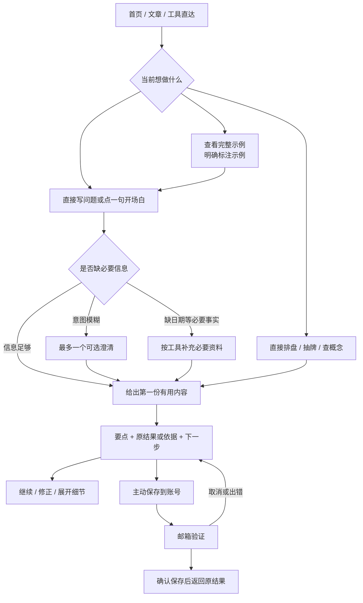

# Wenbu 引导与试用体验：从开始对话到获得有用结果

研究日期：2026-10-06，Asia/Shanghai。对象：首次接触 Wenbu 的中英文浏览器用户，兼顾直接使用工具的人和回来继续探索的人。重点是接下来两轮产品迭代；远期能力单列。

**状态：研究与设计规格，尚未实施或部署。** 本轮重新操作了线上产品，完成一条真实 DeepSeek 对话路径、一次真实塔罗抽取、保存到账号的入口及取消回程检查。源码基线为 `76efb34e766b698edf0b90673e6ec61d45309f85`。没有招募用户、查询生产转化数据或进行 A/B 实验。具体步骤、截图及限制见[本轮体验证据](../reviews/onboarding-trial-2026-10-06/README.md)。

## 1. 结论与优先级

Wenbu 已经具备良好的基础：游客可以直接开始，按钮能直接回复，四种工具保留独立入口，插画和纸墨视觉有辨识度，结果后的邮箱保存也解释了用途。下一轮最值得投入的是**缩短从开始到第一次获得价值的路径，让答案、结果面板和保存动作连贯起来**。

当前最清楚的阻力来自实测：选择工作话题后，Agent 连续三轮询问关注层次、比较维度和使用方法，可用回合从 12 减到 9；第四轮才给出一份 12 项清单。这份清单只出现在聊天正文中，“探索结果”面板仍为空。代码里已有避免澄清循环的指令，因此继续补一句提示词不足以形成可靠约束。

首屏应该更明确地展示用户会得到什么；必要资料应该在需要时，用易懂的字段一次补齐；第一个答案应该有可快速理解的要点和明确的下一步。账号继续服务于保留成果、跨设备使用。试用的核心指标应是完成并看懂一次探索，注册只是后续环节。

以下优先级按阻断程度、修复价值和当前证据判断，**不代表线上发生频率排名**。

| 优先级 | 问题与用户目标                       | 本轮证据                                         | 建议                                                | 置信度 / 频率                |
| ------ | ------------------------------------ | ------------------------------------------------ | --------------------------------------------------- | ---------------------------- |
| P0     | 想获得帮助，却连续回答可选偏好问题   | 一条真实路径出现 3 次连续澄清；第 4 回合才答复   | 在 harness 中限制连续可选澄清；必要资料另走明确规则 | 问题存在：高；总体频率未知   |
| P0     | 想快速理解答案，却收到多屏清单       | 真实回复含 12 项问题；手机截图与 DOM 可复核      | 首答给 3 项要点和 1 个可执行动作，细节按需展开      | 本路径：高；其他题型待测     |
| P0     | 想回看结果，却打开空面板             | 本轮文字答复完成后，面板仍为空                   | 为可留存答复提供统一结果入口，清楚区分聊天与札记    | 本路径：高                   |
| P1     | 尚未开始，不知道值得期待什么         | Agent 桌面右侧只有空状态插画；首屏主要描述话题   | 用清晰标注的完整示例展示产出；保留自由提问          | 画面事实：高；转化影响待测   |
| P1     | 想补出生信息，却同时面对多个专业设置 | 390px 资料窗口同时展示时区、紫微参数、换日与经度 | 按当前工具拆分字段；高级约定折叠，默认约定可见      | 画面事实：高；错误率未知     |
| P1     | 想试一试，却在尚无结果时消耗额度     | 真实澄清每回合扣减；服务端在模型调用前预留额度   | 先减少无效澄清，再测试有上限的引导额度              | 行为：高；成本与增长效果待测 |
| P2     | 回来后想继续原问题，而非重新开始     | 现有会话列表可继续，但首屏以通用入口为主         | 给出最近探索的可恢复入口和真实保存状态              | 设计机会；未研究真实回访者   |

## 2. 研究方法与依据

本轮采用产品操作、源码核对、原始研究及官方产品资料交叉验证。外部研究用于形成假设；Wenbu 的实际问题由本轮截图与操作记录支持。没有把其他产品的增长数据迁移成 Wenbu 的预期收益。

### 2.1 可借鉴的原则

| 来源                                                                                                                                                                                                    | 核实的要点                                                             | 对 Wenbu 的具体启发与边界                                                                                 |
| ------------------------------------------------------------------------------------------------------------------------------------------------------------------------------------------------------- | ---------------------------------------------------------------------- | --------------------------------------------------------------------------------------------------------- |
| [NN/g：Prompt Suggestions，2025](https://www.nngroup.com/articles/prompt-suggestions/)                                                                                                                  | 提示建议应贴合任务、上下文和经验水平；开场与追问承担不同作用           | 开场白同时表达想得到的帮助；追问紧接当前结果。并非选项越多越好                                            |
| [NN/g：Less Chat, More Answer，2026](https://www.nngroup.com/articles/less-chat-more-answer/)                                                                                                           | 对 9 位参与者与 8 个站点聊天机器人的研究强调直接、可扫描、可展开的答复 | 先让人拿到可用内容，再展开深度；该研究不是命理用户实验，也不能推出所有反思对话都应短                      |
| [NN/g：Onboarding Tutorials vs. Contextual Help，2023](https://www.nngroup.com/articles/onboarding-tutorials/)                                                                                          | 脱离任务的教程容易被跳过和忘记；上下文帮助应可关闭、可再次找到         | 不增加强制欢迎轮播；在用户要填时区、读逆位或查依据时提供帮助                                              |
| [Microsoft Research：Human-AI Interaction，2019](https://www.microsoft.com/en-us/research/articles/guidelines-for-human-ai-interaction-eighteen-best-practices-for-human-centered-ai-design/)           | 说明系统能做什么、能力边界，并支持纠正和退出                           | 让“选择题 → 回答 → 修改理解”可控；不要把模型的问卷习惯当产品流程                                          |
| [GOV.UK：Question pages](https://design-system.service.gov.uk/patterns/question-pages/)                                                                                                                 | 只问确实需要的问题，允许合理的“不知道”，可返回修改；关联字段可合理分组 | 一次解决一个信息需求；出生日期和时间可放同一小表单，不机械拆成多轮聊天                                    |
| [Google：Questions](https://developers.google.com/assistant/conversation-design/questions) 与 [Chips](https://developers.google.com/assistant/conversation-design/chips)                                | 一次明确提问；点选文本成为用户回复；选项要说明行动和去向               | 保留现有直接回复方式，不把表单再搬入输入框。相关 Actions 产品已停止服务，借鉴设计原则，不采用其旧平台限制 |
| [Baymard：Delayed Account Creation，2023](https://baymard.com/research-articles/delayed-account-creation)                                                                                               | 电商测试中，主任务中途插入建号会引入干扰                               | 支持在结果之后解释保存收益；不据此声称 Wenbu 注册率将提升某个百分比                                       |
| [GOV.UK：Create accounts](https://design-system.service.gov.uk/patterns/create-accounts/)                                                                                                               | 在必须建号前尽量允许使用服务，账号流程需简洁清楚                       | 邮箱统一入口继续说明首次验证会建号，不额外要求昵称和密码；不照搬政务术语                                  |
| [W3C：Redundant Entry](https://www.w3.org/WAI/WCAG22/Understanding/redundant-entry.html)                                                                                                                | 同一流程中避免要求重复输入已有信息，合理例外另计                       | 已分享日期、问题和牌阵在后续步骤复用，保留可纠正入口                                                      |
| [W3C：Status Messages](https://www.w3.org/WAI/WCAG22/Understanding/status-messages.html) 与 [Animation from Interactions](https://www.w3.org/WAI/WCAG22/Understanding/animation-from-interactions.html) | 状态变化可由辅助技术感知；非必要交互动效可关闭                         | 只展示真实阶段，保留停止和静态替代。后者是 AAA 条款，不把它混写为 AA 必选                                 |

### 2.2 成熟产品的可用模式

这些是**官方资料对照**，没有把帮助中心当作亲自完成竞品 onboarding 的证据。

| 产品 / 来源                                                                                                  | 可借鉴的模式                                                     | Wenbu 取舍                                                                                                                      |
| ------------------------------------------------------------------------------------------------------------ | ---------------------------------------------------------------- | ------------------------------------------------------------------------------------------------------------------------------- |
| [Google Notebook 的聊天说明](https://support.google.com/gemininotebook/answer/16179559?hl=en)                | 可调整答复长度，引用可回到原材料，聊天答复可保存为笔记并保留格式 | 让聊天里的有用内容自然成为札记；“可查证”来自可访问的依据，不来自装饰性徽章。原 NotebookLM 帮助 URL 本轮重定向到 Gemini Notebook |
| [Claude Research](https://support.claude.com/en/articles/11088861-use-research-on-claude)                    | 明确启用研究模式，产出带引用的答复                               | 将快问与资料研习的收益和等待差异讲清楚。Wenbu 当前检索范围是自有手册与精选参考目录，不宣传无限制联网研究                        |
| [Labyrinthos 学习入口](https://labyrinthos.co/pages/learn-tarot-for-beginners-with-our-online-tarot-classes) | 以卡牌关键词练习连接学习、阅读与记录                             | 一次只解释与当前牌有关的概念，再允许深入；不为追求使用频率增加焦虑式每日运势提醒                                                |

搜索了 Wenbu 公开评价、AI 提示建议、上下文帮助、对话澄清、账号时机，以及上述产品官方资料。精确域名检索没有提供足够的独立 Wenbu 用户反馈。没有把 Reddit 个案或第三方案例中的提升数字当作产品结论；本轮也没有内部访谈、客服样本或生产漏斗查询。

## 3. 把试用定义为一次完整的小收获

试用不应只有“用了几回合”的视角。第一次完成后，用户应能回答：**我刚才在探索什么？我得到了什么？下一步能做什么？**

不同任务有不同的完成条件：

| 任务            | 首次可用产出                                        | 不算完成                                           |
| --------------- | --------------------------------------------------- | -------------------------------------------------- |
| 理清选择或关系  | 与已知问题相关的 2–3 个观察点、尚缺的信息和一个行动 | 只重复用户问题、继续询问可选偏好、泛泛鼓励         |
| 看懂命盘        | 真实工具结果、明确输入约定、先看哪一处的短解释      | 虚构出生资料、把五行数量说成强弱或预测准确率       |
| 初次塔罗 / 易经 | 真实抽取结果、简明原义、一个反思问题                | 假装抽牌、强制请求 AI 才可看完整结果、未获同意重抽 |
| 查一个概念      | 直接解释、具体例子、适当来源与边界                  | 先问“想从历史还是应用开始”，却迟迟不解释           |
| 资料研习        | 有限问题的结论、可读来源、尚未核实之处              | 搜索摘要堆砌、只有来源清单、生成失败但显示已完成   |

“结果已生成”“结果进入视窗”“用户理解”“用户觉得有用”是四种信号，不能互相替代。文字很长也不等于有价值。

### 三种起点同时存在

1. **有具体问题的人**直接输入，Agent 利用现有信息开始处理，不强迫走选项。
2. **有方向但表达不清的人**点一句完整开场白，至多先澄清一个可选偏好，再给初步帮助。
3. **只想看看的人**打开清楚标注的完整示例；可以随后换成自己的问题，或主动选择一次真实抽取。

已有账号的回访者优先看到“继续上次探索”，无需重新参加入门引导。SEO 文章、四种工具和 MCP / CLI 仍可独立到达；不要把所有入口都重定向到聊天页。

## 4. 推荐流程

这是建议流程，当前产品尚未完整实现图中的约束。

### 4.1 首屏：用产出来解释价值

保留纸色、墨绿、朱色和现有原创图像。桌面右侧在没有个人结果时，可以提供一份完整示例的预览，展示标题、三项要点和“打开示例”。明确写“示例 · 非个人解读”；首次点击无需模型请求，不消耗对话额度，也不进入真实试用完成队列。示例由编辑与真实工具固定结果维护，不伪装成系统正在为用户计算。

移动端把示例入口放在开场选项附近，用一行按钮进入；不把整份示例挤到输入框之前。先做两条足够不同的示例：一张牌的阅读过程、一个概念的有来源解释。个人命盘作为第三条，始终标明示范数据。

四个现有话题可以保留，但开场白增加明确的帮助目标。以下是候选文案，需要可用性测试，不预设它们必然提高转化：

| 位置         | 中文候选                                             | English candidate                                                           |
| ------------ | ---------------------------------------------------- | --------------------------------------------------------------------------- |
| 首屏辅助说明 | 写下你在意的事，先找到一个可以着手的方向。           | Share what’s on your mind and find a useful next step.                      |
| 工作开场     | 我在工作选择上有些犹豫，先帮我找出最该核实的三件事。 | I’m weighing a work decision. Help me identify three things to check first. |
| 关系开场     | 我想理清一段关系，帮我找到沟通的切入点。             | Help me find a starting point for a difficult conversation.                 |
| 命盘开场     | 我想读懂自己的八字命盘，带我从基础开始。             | Help me understand my BaZi chart, starting with the basics.                 |
| 入门开场     | 用一个简单例子，讲讲塔罗可以怎样帮助反思。           | Show me a simple example of using tarot for reflection.                     |
| 示例入口     | 先看一份完整示例                                     | See a complete example                                                      |
| 模式解释     | 对话：围绕问题梳理；研习：查资料、整理有出处的解释。 | Explore: think through a question. Research: investigate it with sources.   |

用户点选的句子仍是实际发送的句子；辅助说明不能被偷偷拼成个人背景。卡片可以区分主题小标题和完整开场白，但不截断核心意思。英文窄屏优先用可换行的纵向行卡，至少保留一个完整可点击选项和自由输入区，不固定卡片高度。

### 4.2 澄清：用系统约束保证前进

本轮真实行为说明，prompt 中的“不要反复追问”只能作为一层约束。建议增加可测量的任务状态：

- 每个任务记录已发生的可选澄清次数、已知必需字段、是否已经给出首份内容、是否已有原始结果。
- **首次价值之前，最多一个可选澄清。** 这是产品初始设计预算，不是学术最优值；后续以任务测试调整。
- 用户已给足信息、请求例子、定义、改写或明确输出格式时，直接回应。用户回答“不确定”后也要提供可用起点，不能无限缩小问题。
- 必要资料由工具输入校验决定。例如八字缺公历日期或时区、紫微缺已知时刻与必要参数可以要求补充。不能把“喜欢哪种风格”“想用塔罗还是易经”包装成必需信息。
- 已答过一次可选澄清后，服务端不再允许模型用同类 `ask_user` 阻塞首答；下一次模型调用只允许给出初步内容或补真正缺失的必需资料。若仍无有效输出，给可恢复的有限帮助，不伪造完成状态。
- 重置任务、刷新页面、换语言不得成为反复获取免费模型调用的入口。涉及额度的状态由服务端维护；不信任客户端传回的次数。

“每次只问一个问题”和“每次都先问一个问题”含义不同。选项应降低表达成本，而不是延长流程。保留“我自己说”“暂时不确定”，允许用户更正理解。只在用户明确请求或同意时进行随机抽取。

本轮工作场景，第一次点选“有两个选项”后就可给出下面的简短起点：

> 比较长期发展，可以先核实三件事：能积累什么可迁移能力、是否有真实的成长机会、退出成本有多大。目前还没有两个岗位的具体信息，因此不能判断哪一个更适合你。
>
> 下一步：各找一条事实，填入这三个维度。你可以先告诉我两个选项的大致情况。

这是一份示范写法，不是对用户职业的实际建议。它在信息不全时说明边界，同时已经提供帮助。

### 4.3 必要资料：小表单应完成一件具体的事

出生日期、时间和时区适合结构化输入；问题背景适合自然表达。原先“填好表单 → 拼长提示词 → 放入输入框 → 再发送”的方式不应回来。

| 当前任务     | 首先显示                                         | 其余设置                                             |
| ------------ | ------------------------------------------------ | ---------------------------------------------------- |
| 八字         | 公历日期；已知时间 / 不知道；出生时区            | 换日、真太阳时折叠到“计算约定”；摘要显示当前默认约定 |
| 紫微         | 公历日期；确切时刻；时区；算法所需参数及用途解释 | 不同时展示无关的八字换日设置；未知时刻不擅自取中点   |
| 塔罗 / 易经  | 当前问题可选或按解读需要补充                     | 不要索要生日、姓名或完整个人档案                     |
| 一般知识解释 | 问题本身                                         | 不打开个人资料表单                                   |

时区首先使用用户理解的名称，例如“中国标准时间 · Asia/Shanghai”，保留搜索和明确修改；不能把当前设备时区自动当作出生时区。更复杂的出生地辅助选择需另行评估历史时区映射，不交给模型猜测。

在提交附近说明“将分享哪些资料”；复用已明确选择的信息，不重复问。表单底部显示具体动作，例如“使用这些资料排盘”，必要时固定操作区但不能挡住错误和末尾字段。关闭时保留原结果与草稿，行为应区分“取消本次修改”和“已分享内容无法从过去消息撤回”。

### 4.4 试用：先减少浪费，再改变额度口径

**第一阶段保留当前额度规则，优先消除无意义的追问。** 在当前规则下诚实说明模型澄清也会使用回合。不能在机制未改时宣传“引导不扣额度”，也不能承诺登录后增加或重置额度。

第二阶段可测试“每个新任务包含一次引导回应”的方案：用户的普通可用回合与平台实际模型成本分开记录；该引导配额有按日、访客 / 账号、网络和全站的独立上限。未获得实质答案的纯澄清不能被统计为已完成探索。模型调用始终计入全站成本和滥用控制。

不建议按模型自称“这只是澄清”无限退款，也不建议把所有无答案请求都返还，因为上游可能已产生成本。需要复用当前原子预留和请求幂等机制，处理取消、超时、重复提交、刷新、登录合并及并发。

短期更安全的降低试用门槛方式是**零模型成本的完整示例**，以及保留四种免费工具。想真实体验塔罗的新手可以主动选择“一张牌开始”，不强行改变已明确选定的三张或逆位设置。

### 4.5 首份结果：让重点、细节和留存连在一起

首答采用三层阅读结构：

1. **先读懂**：一句针对任务的摘要、最多三项要点、一个现实可执行的下一步。一般反思首答可先以中文约 150–300 字 / 英文约 100–180 词作为编辑起点；不是硬性剪裁安全边界或来源说明的上限。
2. **看具体结果**：真正的牌面、命盘、比较表或步骤。表格和图形只有在帮助比较或理解关系时出现，不添加无依据的性格评分、运势曲线或百分比。
3. **继续查证**：计算约定、传统含义、解释与局限、来源和完整过程可展开。与结论相关的重大限制必须在第一层出现。

桌面可以保留聊天与札记并排。手机在聊天流中直接出现结果摘要和一个具名按钮，例如“查看这份比较清单”，不用让新手猜顶部图标。没有新札记时，按钮显示“本次答复在对话中”，或者隐藏无内容的结果入口，并提供返回答复的位置。

对可留存的文字答复提供“留为札记”。优先将**已存在的同一内容**结构化或引用保存，不能为了保存再调用模型写一份不一致的答案。若需要生成新摘要，应明确为新版本。札记需要稳定 ID、原消息关联、原始结果引用和版本；流式部分内容不冒充终稿。

结果末尾建议顺序为：一个相关继续动作、保存或导出、轻量反馈。当前“这次有帮助吗”可保留，但不能让多个反馈和保存入口比内容本身更抢眼。

### 4.6 注册与回访：承接用户已经想保存的东西

本轮塔罗结果后的邮箱入口表现合理：先看完整牌阵，点击保存才出现邮箱面板；面板带有记录摘要；取消后回到原结果并保留浏览器副本。应保留。

进一步优化的是覆盖范围和承接，而非增加弹窗频次：

- 文字答复也能通过统一的保存入口保留；已存在的固定对话保存入口继续可用。
- 当前记录名称、保存范围、后续是否默认同步都清楚说明。邮箱验证和云端落库是两个状态，后者未确认时不能显示“已保存”。
- 手机邮箱输入、系统验证码填充、错误重试、切回页面、离线待同步，都要用真实邮箱和设备单独验收。本轮未完成这些实测。
- 完成后回到原结果与阅读位置；取消后还能继续，额度不因注册重置。
- 回访显示最近探索的标题、简短摘要、更新时间、真实同步状态；提供“继续这次探索”“补充后来发生的事”，而不是自动重新抽牌。
- 保留注册提示频控。不根据敏感话题推送提醒，不使用“今天不看会错过好运”等压力文案。

沿用[注册时机研究](registration-timing-2026-10-05.md)的先结果、再保存原则。旧文档中的首版问题有些已修复，当前状态以本轮证据和最新发布记录为准。

## 5. UI 与仪式感应该帮助理解状态

| 场景            | 推荐表现                                   | 必须保持的行为                                 |
| --------------- | ------------------------------------------ | ---------------------------------------------- |
| 点选开场 / 回复 | 选项轻反馈后成为用户气泡，其他同组选择退出 | 仅提交一次；保留未发送草稿；不突然打开手机键盘 |
| 等模型开始      | “正在处理你的问题”，一个低干扰标记         | 不提前声称正在查书、排盘或完成百分比           |
| 工具真正开始    | 简洁阶段与对象，如“正在核对出生时区”       | 只根据真实事件更新；过程详情可展开             |
| 原始结果到达    | 牌面 / 四柱先出现，解释随后补上            | 不为动画延迟已经可用的数据                     |
| 可选澄清        | 简短问题和可点选回答                       | 不播放报告入册或完成庆祝                       |
| 一次探索完成    | 单次、克制的收束动效，出现阅读和保存入口   | 本地、云端、未保存状态分别表达                 |
| 停止 / 部分失败 | 稳定显示已完成内容和可恢复动作             | 不重抽、不丢问题、不把重试中说成最终失败       |

动效节奏的候选值：选项反馈约 120–180ms，结果结构出现约 200–320ms；这些是设计起点，需在真实设备验证。已有“纸墨成章”语言和减少动效开关继续使用，不新增全屏洗牌仪式或人为等待。

可访问性验收包括键盘操作、焦点归还、状态消息、文本缩放、减少动效和可触达操作区。手机主要按钮以约 44px 点击区域为设计目标；这不是把 WCAG AA 的 24px 最小目标尺寸条款改写成 44px。中英文使用自然换行，按钮不以中文长度设死宽高，状态也不能仅靠颜色区分。

本轮窄屏英文入口可读，未见水平裁切；320px 时“还没想好”等后续入口在内部滚动区下方。后续应测试单列行卡与现有双列卡片，衡量找到合适起点的效率，不能仅凭更整齐决定胜负。本轮没有进行完整 WCAG 或真实手机软键盘验收。

## 6. 指标必须能区分“交互多”与“真正有用”

当前基础可继续使用：`agent_started` 区分 guided / clarification / followup / example；服务端 `agent_finished` 区分 waiting / complete / limited；已有提示曝光、保存及账号队列。

源码确认，**等待澄清不会进入现有账号完成回执**。当前 Agent 完成回执要求完整结束、没有待答问题，并有 artifact 或至少 80 字符文本；这是业务操作代理，仍不足以证明用户看懂。不能把这一点误写为“当前把所有澄清算激活”。

建议增加版本化的 `onboarding-v2` 观测约定，保持老口径可查，不重命名后混算历史：

| 指标           | 分子 / 分母与窗口                                                                 | 采集依据及限制                                           |
| -------------- | --------------------------------------------------------------------------------- | -------------------------------------------------------- |
| 首次任务完成率 | 有有效产出的新手任务 / 已被服务端接受的新手任务；统一 24 小时窗口，单列未成熟任务 | 服务端任务和产出回执；示例、QA、错误、纯澄清不算有效产出 |
| 开始到可读结果 | 首次提交到首份合格结果进入视窗的 p50 / p75                                        | 同一可测量任务关联客户端与服务端；缺失可见事件不补成成功 |
| 连续澄清比例   | 首份内容前发生 2 次以上可选澄清的任务 / 进入引导的任务                            | 区分必需资料与可选问题；同时显示基数                     |
| 结果找到率     | 打开或看到关联结果的任务 / 已生成结果且可测量的任务                               | 显示“可见”与“主动打开”两类，不叫读懂率                   |
| 理解与帮助程度 | 测试中能复述要点 / 参与该任务的测试者；产品内反馈单列                             | 访谈与可选反馈；无回答保留未知，不能当负面               |
| 引导成本       | 首份结果前的模型调用数、耗时与成本 / 完成任务                                     | 分语言、入口、模式；同时观察失败任务成本，避免幸存者偏差 |
| 保存成功率     | 得到目标记录云端回执 / 明确发起该记录保存的尝试                                   | 与邮箱验证成功、提示点击分列，重试按操作 ID 去重         |
| 7 日有效转化   | 既注册又保存有效结果的成熟试用队列 / 同一成熟试用队列                             | 延续 account-v2 的独立队列，不拿不同库的汇总数直接相除   |
| 回访价值       | 已激活用户 D1 / D7 新完成操作                                                     | 成熟队列、独立窗口；仅打开页面不算再次获得价值           |

新增候选事件仅记录必要元数据：`task_started`、`clarification_shown`、`clarification_answered`、`first_deliverable_ready`、`first_deliverable_visible`、`result_next_action`。事件名是方案，**当前并未加入契约**。与已有事件一一映射，能派生的指标不重复采集。

可见事件的初始约定可设为：已完成结果的短摘要区域至少一半可见、页面在前台且持续一秒；按任务、结果 ID 与版本去重。计时使用同一客户端的单调时钟，服务端生成耗时单独统计；刷新导致时间链不完整时保留未知。该约定只测可见机会，不能证明用户已阅读。

只允许封闭枚举、匿名任务关联、序号、耗时、语言和设备类型；不把问题正文、出生信息、邮箱、验证码或自由文本标题写进分析。用户的问题类别若涉及敏感背景，不作为增长分群。浏览器可测量流量、搜索爬虫、Agent、测试、未知分类分别统计，不把浏览器标签称作已证实的自然人。

任务关联沿用既有受控操作标识和试用队列，不用邮箱拼接流量身份；所有实验考虑退出统计、DNT / GPC、存储受限和阻断的覆盖缺口。Clarity 只辅助观察界面问题，敏感字段保持遮罩，不替代服务端业务回执或用户访谈。

## 7. 实施顺序与代码落点

### 这一轮优先完成

| 工作包             | 主要位置                                                              | 可验收的结果                                                                       |
| ------------------ | --------------------------------------------------------------------- | ---------------------------------------------------------------------------------- |
| 限制可选澄清循环   | `worker/agent.ts`、`worker/agent-tools.ts`、任务状态与协议            | 已答一次可选澄清后能得到初步内容；缺必需资料仍安全暂停；并发和刷新不绕过预算       |
| 首答与结果面板承接 | `AgentWorkspace.tsx`、`AgentReport.tsx`、`AgentConversationGuide.tsx` | 当前任务的答复、札记与原结果可定位；手机有具名按钮；空面板不会让用户误以为结果丢失 |
| 真实模型场景回归   | `tests/` 与现有模型验证脚本                                           | 覆盖下方任务矩阵，多次运行记录分布；受控 fixture 和真实模型结果分别报告            |

### 下一轮改善入门与理解

| 工作包                 | 主要位置                                                         | 可验收的结果                                                             |
| ---------------------- | ---------------------------------------------------------------- | ------------------------------------------------------------------------ |
| 首屏产出示例与开场文案 | `Home.astro`、`AgentOnboarding.tsx`、`agent-guidance.ts`         | 示例明确标注且不扣额度；用户无需读教程即可开始；四种工具仍可独立进入     |
| 按任务补资料           | `AgentWorkspace.tsx` 中资料窗口、`ToolDesk.tsx`                  | 八字与紫微字段按需要展示；未知时间不造假；修改、取消和发送范围清楚       |
| 双语手机阅读           | `agent.css`、共享样式、结果组件                                  | 320 / 390 / 768 / 1280px，中文和英文长文案、放大文本、键盘与减少动效可用 |
| 版本化指标             | `analytics-contract.ts`、`account-agent.ts`、报表查询与 Insights | 当前指标不混入新定义；等待、完成、可见、保存和有效转化分开               |

### 有基线后再决定

有上限的引导额度、回访摘要和单牌入门默认策略，都需要成本基线与用户验证。暂不同时改变入口、免费额度、模型和注册时机，否则难以判断结果来自哪里。不新增强制个人资料问卷、打卡压力或注册墙。

## 8. 验证计划

先做 8–12 位新用户的定性测试，覆盖中文 / 英文、手机 / 桌面，以及熟悉 / 不熟悉命理的人；这是发现问题的招募起点，不是统计代表性样本。不要先教用户如何操作，也不要只问“喜欢吗”。

| 任务                         | 观察问题                                 | 通过条件                                       |
| ---------------------------- | ---------------------------------------- | ---------------------------------------------- |
| 只知道自己对工作选择犹豫     | 能否自己找到起点？什么时候开始觉得有用？ | 最多一次可选澄清后有初步帮助；知道如何补充事实 |
| 输入一个足够具体的问题       | 是否被强迫重新选主题或方法？             | 直接处理，不重问已知信息                       |
| 连续回答“不确定”             | 会不会落入更长问卷？                     | 给可用示例或有限帮助，不编造个人背景           |
| 想看八字但不知道出生时间     | 是否知道可以继续？理解缺了哪部分吗？     | 使用无时柱结果或明确解释；不假定中午           |
| 选择紫微但缺必要参数         | 是否说明为何需要，而非通用报错？         | 只补必要字段，不能生成虚构完整盘               |
| 用一张牌首次探索             | 分得清牌面、传统含义和个人解释吗？       | 看懂一个要点；没有强制 AI 或注册步骤           |
| 找回刚得到的清单             | 能否找到结果并说出下一步？               | 聊天与札记的入口一致，内容不矛盾               |
| 保存时暂不注册               | 会不会担心答案消失？取消后能否继续？     | 原结果与草稿保留，存储状态真实                 |
| 验证成功但云端保存失败       | 用户是否误以为已完成？                   | 显示待同步 / 失败，可恢复，不重复抽取          |
| 英文长选项、手机键盘与大字号 | 是否遮住选项、错误或主要按钮？           | 内容可读、可滚动、焦点可到达，不靠截断维持布局 |

真实 DeepSeek 回归建议从 12 个代表任务、每语言每任务 3 次开始，共 72 次；先确认成本预算，再执行。这个数量用于发现不稳定分支，不是保证模型永不出错。记录可选澄清次数、首份内容类型、工具事实正确性、是否意外抽取、时间与失败恢复；结构检查之外还需人工判读内容是否有用。

产品实验按顺序进行：

1. 先上线可靠性修复与观测，形成基线。已确定的交互缺陷无需故意留给一组用户。
2. A/B 只比较“当前开场”与“带明确产出目标的开场”；其他额度、模型与保存逻辑保持一致。
3. 单独测试首屏完整示例的可发现性，区分示例浏览和真实任务启动。
4. 最后测试有上限的引导额度。主要看完成并看到首份结果的比例、成本和有效保存；同时检查错误、退出、用量耗尽和继续使用是否变差。

实验前根据基线、最小有意义差异和统计方案计算样本；按固定匿名分组观察，展示分母与区间。低流量时先根据定性测试修正清晰的阻力，不能靠少数点击宣布胜出。注册 / 保存至少等待相应 7 日窗口成熟，D7 留存另等完整窗口。

## 9. 交付与未完成事项

本轮交付研究规格、双语候选文案、任务流程、优先级、指标定义、测试矩阵，以及本轮线上截图。导航已接入[文档总览](../README.md)、[研究索引](README.md)和[审查索引](../reviews/README.md)。

本轮没有修改运行时代码、发布新 UI、改变额度、执行真实邮箱注册或发送推广；没有生产漏斗查询、完整辅助技术测试、真实手机软键盘测试或模型批量稳定性结果。真实试用产生了一条测试对话和一次塔罗结果；账号保存入口保留了浏览器副本，没有完成云端注册保存。操作使用测试标记，未另行查询后台落库验证。截图只证明捕获时刻的界面。

接下来的首个实现目标应明确为：**同一个新手任务，最多一个可选澄清后能得到可理解的内容；这份内容有一致的查看、继续与保存路径。**
