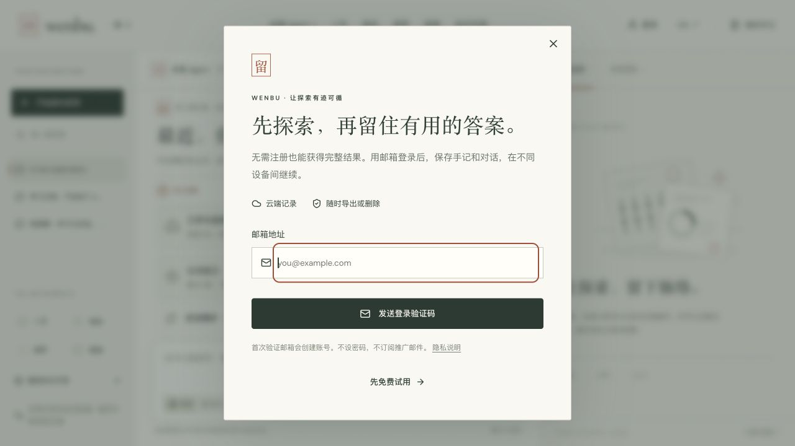
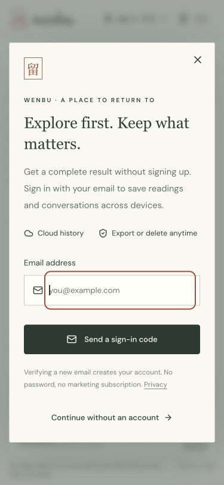
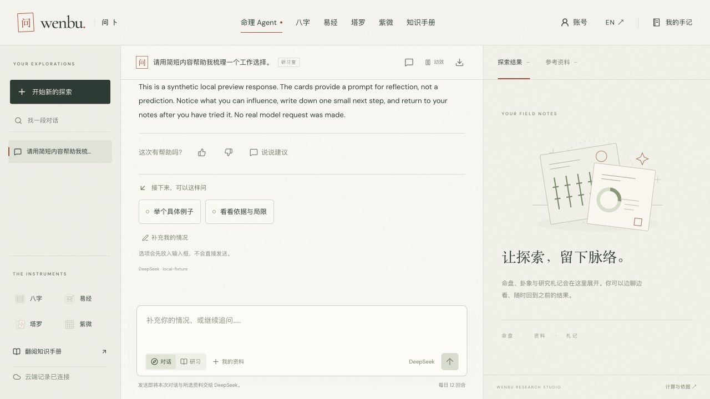

# Email accounts and cloud history — 2026-10-05

This release implements the first email-account/cloud-history slice while preserving complete guest trials and public tool/MCP/CLI access. It does not implement private MCP OAuth, passkeys, background Agent execution or collaborative offline editing.

## Local evidence

- `npm run verify`: 302 unit/regression tests, native workerd integration checks, type checks, build and content/asset audits pass. The final native handler suite contains 64 checks with synthetic mail and model responses.
- Native D1 tests exercise guest-result activation, stable imports, concurrent revision writes, ownership headers, pagination, UTF-8/account byte limits, server Agent checkpoints, one-time/concurrent/expired/incorrect OTP handling, provider failures, opt-out metrics, fixed guest cohorts, mature activation-day retention and cross-instance continuation.
- Recovery tests recreate deleted native D1 records/identity/session rows, prove that independent ledger state still blocks reads/writes, then replay deletion in maintenance and revoke all sessions. Unit tests exercise erasure retries beyond nominal expiry. This is a local restore simulation, not a remote production Time Travel drill.
- Browser testing used the disposable preview: complete guest conversation → email verification → save original conversation → follow-up → reload, plus account sign-out and Chinese/English account screens. Initial blank-conversation redirection and empty cloud drafts were found and corrected. A stale guest reimport now conflicts instead of overwriting an existing cloud continuation.
- English mobile at 375 × 812: page scroll width 375; account dialog width 345. Native dialog focus, text wrapping and scrollable content were checked. Screenshots contain synthetic `.test` account data only.
- Lint, Worker bundle dry-run and production dependency audit pass; no vulnerabilities were reported by the audit at validation time.

## Provisioning

A separate private USERDATA D1, four additive migrations, stable account data key and auth secret were provisioned. Existing traffic D1, R2 archives, global quota and model configuration are retained. Cloudflare Email Sending showed wenbu.app enabled/configured. No real email was sent during these local tests.

## Production release

- [PR #11](https://github.com/wenbu-app/wenbu/pull/11) merged as `9c50a24916d7c127b0e51f71b7bba8a6ca2d839b`. The [Quality run on that exact main commit](https://github.com/wenbu-app/wenbu/actions/runs/37264802858) passed.
- Cloudflare deployed Worker version `88afa74c-55c9-4c7d-b564-3950154cbf2f` to the existing three domains. USERDATA, the independent deletion ledger and the unrestricted-recipient sender binding were confirmed in the deployment output. This does not establish actual mailbox delivery.
- [Public smoke receipt](live-public.json): 96 public/discovery routes, calculation APIs, MCP discovery/tools and knowledge access passed. No paid model request was made by this live smoke run.
- [Account smoke receipt](live-accounts.json): 14 checks passed, covering private/no-store responses, anonymous denial, origin/input rejection before delivery, signed guest result receipts and account-v2 reports at 1/3/7/14/30 days. This created no account and sent no mail.
- [Existing analytics receipt](live-analytics.json): 1/3/7/14/30/90-day totals, hourly/daily boundaries, dimension filters and invalid-query rejection passed. The production Insights UI also rendered the new account section and switched to the 30-day account cohort independently of the traffic filters.
- The live Chinese email entry renders and focuses the email field. The local UI export downloaded a complete JSON file containing the original synthetic conversation, with no outstanding or browser-only records. Its contents are not published.
- IndexNow's live manifest matched on the post-propagation check. Submission remained in the existing HTTP 429 backoff until the recorded retry time. No new acceptance receipt or indexing claim is made.

## External checks and limits

Grok CLI was invoked but returned HTTP 402 (usage balance exhausted). It produced no review verdict. A test recipient was requested from the user; actual provider acceptance/inbox arrival/OTP verification across real mail services are not established by the synthetic tests.

No claim is made about production conversion uplift, retention, mailbox delivery rate, search indexing or acquisition. [release.json](release.json) separates the deployed/live state from external checks still pending.

