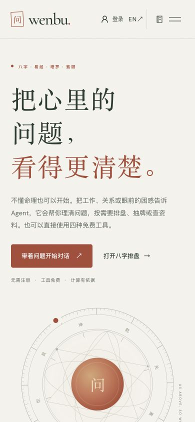
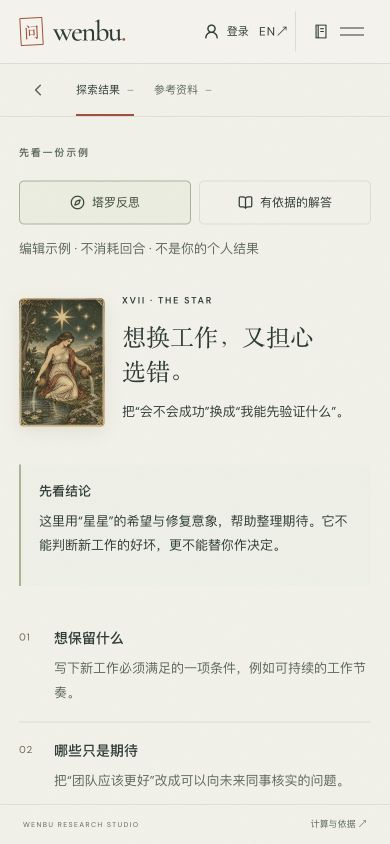
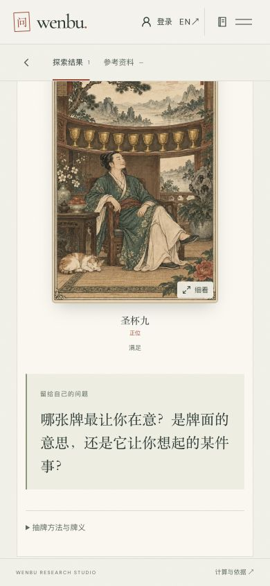
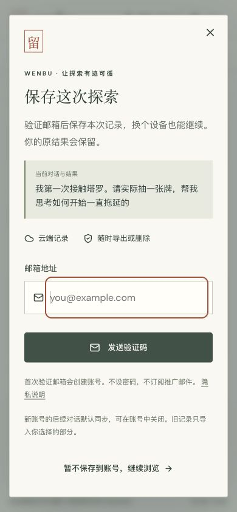
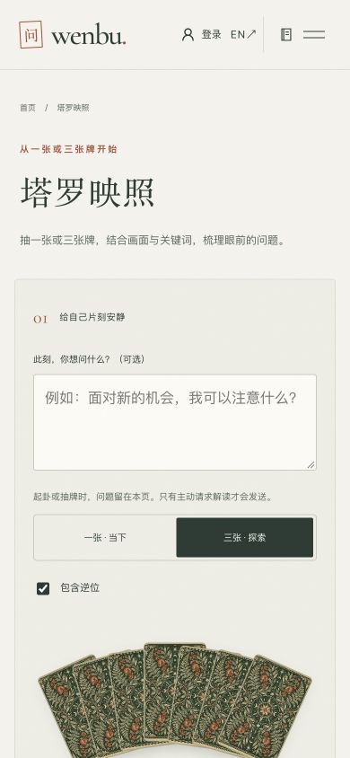
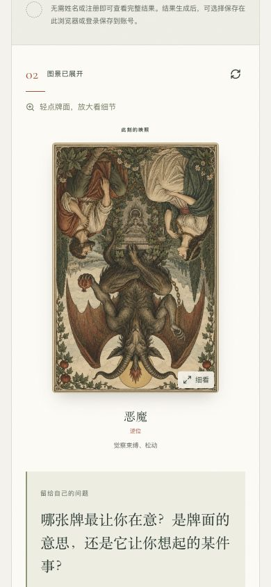
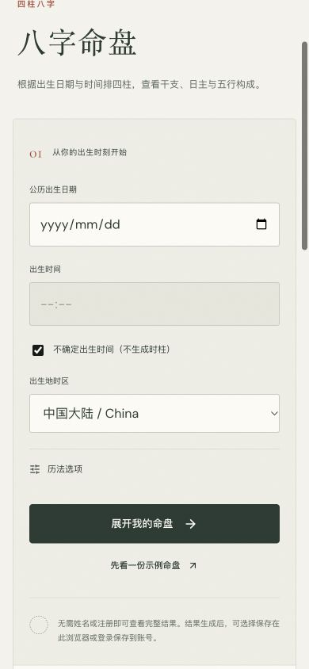
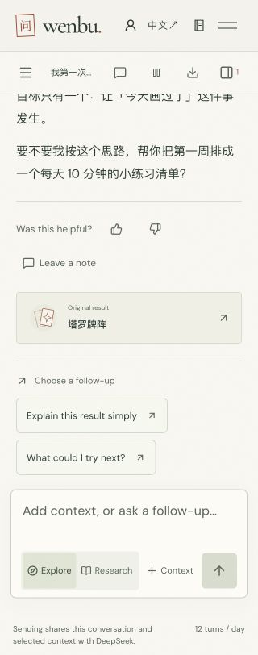

# 上线后引导与试用审查：9 步新证据

审查日期：2026-10-06，Asia/Shanghai。源码基线 `2426d4ddefe4ddb4dea3845c91b097b81b42dff8`。本轮仅研究，没有改运行代码或部署。方案见[下一阶段体验研究](../../research/onboarding-next-experience-2026-10-06.md)。

使用本次任务创建的 Codex IAB 标签，中文 390×844，英文 320×812。全部图片为本轮实际操作后的完整视口截图；已保存并重新打开检查原文件。浏览器已有历史测试状态，不能称为隔离的首次访客实验。页面滚动位置见各图，不把一张视口截图当整页内容。

| 步骤 | 内容                   | 评价                     |
| ---- | ---------------------- | ------------------------ |
| 1    | 首页移动端             | 基础良好，入口仍可更直接 |
| 2    | Agent 起步             | 需优化首屏可见性         |
| 3    | 完整示例               | 内容良好，实践承接不足   |
| 4    | 真实抽牌与解读         | 抽取成功，成果分散       |
| 5    | 结果后的账号邀请       | 时机合理，预览可加强     |
| 6    | 独立塔罗轻试用         | 工具可用，新手步骤偏重   |
| 7    | 不确定出生时间         | 未知时间处理良好         |
| 8    | 切换英文与继续已有对话 | 原文保留，局部布局通过   |
| 9    | 英文小屏新会话         | 无横向溢出，入门入口偏后 |

## 证据边界

- 实际 DeepSeek 对话 1 次，主动请求抽一张牌；另有独立工具抽牌 1 次，未请求其 AI 解读。输入是测试用绘画练习场景，没有个人生日或身份资料。
- 本轮模型抽出圣杯九正位；两个客户端事件间隔 4,854 毫秒。这是单次开始至完成事件差，不是首字时延或人群统计。见 [trial-events.json](trial-events.json)。
- 测试 Cookie 和前端 session 标记都设置后，两个对话事件均为 test=true。仅设置 Cookie 的代码缺口已写入研究；设置会话标记前的首页事件可能不被排除。
- 保存弹层可取消，取消后结果仍在。未发送邮件、未建号、未验证真实送达与跨设备保存。
- 320px 下测得根文档宽度也是 320px；顶部 Open conversations、Feedback、Show results 三按钮均 44×44。这是局部尺寸检查，不能扩展成全站无障碍通过。
- 未覆盖实体手机键盘、读屏、缩放、慢网络或所有故障；没有用户访谈和 A/B 实验。已有会话、统计或旧截图不替代本轮证据。
- 没有读取邮箱、出生资料、私密对话等生产明细；仅查询受保护聚合统计，原始文件留在 Git 忽略目录。
- 本轮临时测试标记、视口覆盖与审查标签已清理。合成测试会话仍按产品现有行为留存；未删除用户历史。

## 1. 首页移动端 — 基础良好，入口仍可更直接

**有效之处：** 品牌统一；免注册与免费可见；主要按钮明确。

**发现与建议：** 390px 首屏第二入口直接进入专业排盘；低资料成本的互动试用不在首屏。

**边界：** 启发式判断，不代表真实访客流失；现有浏览器配置，不是隔离的新用户。

## 2. Agent 起步 — 需优化首屏可见性

**有效之处：** 可直接提问，有完整示例，不要求注册。

**发现与建议：** 390×844 下只有前三张卡完整露出；从零入门和未想好在对话滚动区下方，恰好是最需要帮助的人看不到的入口。顶部多组图标、对话研习与我的资料并行。

**边界：** 未测物理手机键盘；不能仅凭截图断定焦点被遮挡。

## 3. 完整示例 — 内容良好，实践承接不足

**有效之处：** 牌面、结论、三条启发分层；明确标注编辑示例，未假装为个人抽牌。

**发现与建议：** 手机端主要承接动作在长内容底部；开始我的问题将回到空输入框，缺少与示例对应的可直接参与入口。

**边界：** 静态示例并不证明真实模型每次达到此质量。

## 4. 真实抽牌与解读 — 抽取成功，成果分散

**有效之处：** 无前置表单或澄清；真实工具抽出圣杯九正位；给出今天可做的 10 分钟练习；主动区分传统意象与未读取的原创插画。

**发现与建议：** 结果仍有长段落；跟进正文建议一周清单，按钮却是泛化的白话解释和接下来做什么；当前截图处牌面还藏在结果按钮里。 打开结果后只有牌面、关键词与通用反思，没有绘画练习这次的结论；同一次体验需要两处来回阅读。

**边界：** 仅一个真实模型样本；过程结束到采样间可能发生滚动，不作为默认首帧；不能认定所有回答都冗长。

## 5. 结果后的账号邀请 — 时机合理，预览可加强

**有效之处：** 用户主动点击后才打开；目的为保存当前记录；邮箱单字段、免密码与不订阅邮件清楚；退出可见。

**发现与建议：** 保存预览使用被截断的长提问，无法一眼确认保存了圣杯九与绘画练习结论；底部说明较密，需物理手机键盘检查。

**边界：** 没有发送验证码、创建账号或验证邮件送达及跨设备同步。

取消验证：点击“暂不保存到账号，继续浏览”后，弹层数量为 0，原始结果按钮仍存在。本轮未触发验证码发送。

## 6. 独立塔罗轻试用 — 工具可用，新手步骤偏重

**有效之处：** 有牌背细节、问题可选、不先注册、不先调用模型。

**发现与建议：** 目前显示三张与包含逆位；术语选择出现在第一次看到结果之前。390px 首屏为我抽牌按钮在折叠以下。适合提供单张、正位的显式初学者入口，保留完整设置。 单张抽取成功，但反思问题仍写哪张牌；结果页有导出给 Agent，却没有直接带着这张牌继续站内对话的动作。

**边界：** 本截图是在已有测试浏览器中打开，默认值另以源码核实；尚未请求 AI 解读。

代码核对：`ToolDesk.tsx` 初始值确为三张、包含逆位。单张正位仅是下一轮明确标注的新手入口建议，不改变已有抽取。

## 7. 不确定出生时间 — 未知时间处理良好

**有效之处：** 勾选后正确禁用时间；说明不生成时柱；有示例退路；历法设置折叠。

**发现与建议：** 出生地时区只有少量预设，用户必须自己理解城市和历史时区差异；可补充城市检索与用途说明，不能以设备当前时区代替出生地。

**边界：** 只检查交互状态，未输入真实生日、未重验历法准确度。

## 8. 切换英文与继续已有对话 — 原文保留，局部布局通过

**有效之处：** 本轮中文结果在英文界面仍保留原文；320px 没有页面横向溢出；抽查顶部三个图标按钮均 44×44。

**发现与建议：** 多个面板入口仍依赖无文字图标，英文初学者不一定理解 Explore、Research、Context 各自用途；不能用没有横向溢出替代理解度。

**边界：** 只测试单个英文会话状态；未覆盖所有页面、系统缩放和实体键盘。

## 9. 英文小屏新会话 — 无横向溢出，入门入口偏后

**有效之处：** 英文自然换行，没有横向溢出；核心文本输入仍可用。

**发现与建议：** 320×812 仅前两张引导卡完整可见，入门卡与找切入点排在滚动区后部；固定输入区包含模式解释与选项，占用了引导可见空间。

**边界：** 桌面浏览器窄视口模拟，不等同 iOS/Android 实机键盘测试。

## 文档复核

源码核对涵盖前端测试标记、事件传输、服务端分类、账号队列窗口、结果派生、后续建议、工具默认值。截图事实、代码行为、建议和待验证效果分开记录。Grok CLI 在 75 秒期限内未返回结论，因此没有 Grok 通过结论。本轮完成的是独立的源码复核、来源核对与文档/链接检查。
