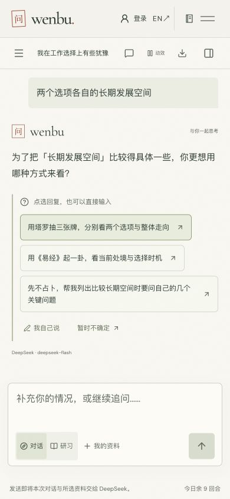
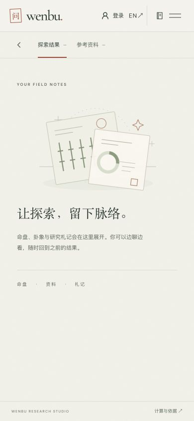
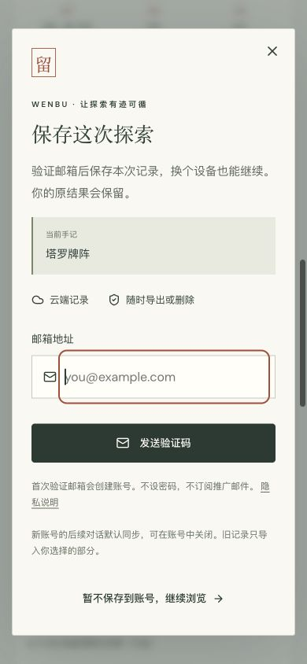

# 引导与试用体验：本轮线上证据

检查日期：2026-10-06，Asia/Shanghai。产品：https://wenbu.app/ 。研究与建议见[完整报告](../../research/onboarding-trial-experience-2026-10-06.md)。

[结构化证据清单](evidence.json)记录观察范围、真实调用次数、截图尺寸和 SHA-256，便于后续 Agent 复核；不包含账号标识、Cookie 或历史会话正文。

## 范围与方法

Codex 内置浏览器，本轮新建的检查标签页。查看 1280 × 900 桌面、390 × 844 手机宽度和 320 × 740 窄屏；均为桌面浏览器视窗模拟，不能代替真实手机软键盘、触摸和屏幕阅读器验证。

使用新建对话和公开选项，没有输入真实个人经历、出生资料、邮箱或验证码。模型页显示 DeepSeek / deepseek-flash；四次真实对话提交与一次真实塔罗抽取成功返回界面。没有将请求别名当作已核实的实际模型名称。

原有浏览器里已有历史记录，因此这不是全新安装或清空存储的实验。首次引导是通过新建对话检查；桌面 Agent 截图裁掉历史侧栏。所有保留截图都是本轮采集、保存并重新打开检查；首页初次动画未结束的截图已用稳定画面替换。历史发布截图没有充作当前证据。

检查前设置了产品测试 cookie，检查后删除并恢复视窗，关闭自建标签页。没有查询后台来独立确认这些事件的入库分类。塔罗保存入口会先保留浏览器副本；本轮没有验证云端落库或邮箱送达。

## 逐步检查

| 步骤 | 路径与动作                       | 健康度                       | 实际观察与证据                                                                                                                                                   |
| ---- | -------------------------------- | ---------------------------- | ---------------------------------------------------------------------------------------------------------------------------------------------------------------- |
| 1    | 首页进入 Agent                   | 良好，有提升空间             | 主 CTA 和免注册说明清楚；首屏尚未展示完整产出示例。[首页](01-home-desktop.png)                                                                                   |
| 2    | Agent 新对话入口                 | 可用，期待不够具体           | 四句开场白、自由输入、工具折叠入口齐全；桌面结果区是空状态。[桌面](02-agent-entry-desktop.png)                                                                   |
| 3    | 点“我在工作选择上有些犹豫”       | 单步清楚                     | 收到“最想理清哪一层”的四个选项；剩余 11 回合。[第一次澄清](03-live-clarification-mobile.png)                                                                     |
| 4    | 点“已有两个具体选项，想比较取舍” | 存在连续追问风险             | 继续询问比较维度；剩余 10 回合。[第二次澄清](04-live-second-clarification-mobile.png)                                                                            |
| 5    | 点“两个选项各自的长期发展空间”   | 需优先改善                   | 再问用塔罗、易经还是问题清单；剩余 9 回合，尚无实质结果。[第三次澄清](05-live-third-turn-mobile.png)                                                             |
| 6    | 选择列出关键问题                 | 有内容，阅读负担偏大         | 第四轮返回 12 项清单和使用建议；剩余 8 回合。没有生成札记 artifact。[回复末段](06-live-result-mobile.png)                                                        |
| 7    | 打开探索结果                     | 承接不清楚                   | 面板仍为空；文字答复还在对话中，不能误称内容丢失。[结果面板](07-live-empty-result-panel.png)                                                                     |
| 8    | 打开资料并选择出生资料           | 功能可用，信息密度偏高       | 日期、时间、原始 IANA 时区、紫微参数、八字换日和经度同时出现；首个视窗看不到底部动作。[资料窗口](08-context-mobile.png)、[出生资料](09-birth-context-mobile.png) |
| 9    | 直接塔罗工具，点“为我抽牌”       | 流程短且结果明确             | 无需注册或模型对话便得到 3 张真实牌面；可放大查看，原始结果和 AI 解读分开。[入口](10-tarot-entry-mobile.png)、[结果](11-tarot-result-mobile.png)                 |
| 10   | 点免费保存到账号，再取消         | 入口与回程良好；完整认证未测 | 面板带“塔罗牌阵”摘要、邮箱用途、创建账号说明和退出按钮；取消后原三张牌保留，并显示浏览器保存状态。[邮箱入口](12-save-email-mobile.png)                           |
| 11   | 英文新对话，390px 与 320px       | 可读，窄屏仍需优化密度       | 开场句自然换行；320px 的后续入口需要在内容区继续滚动。[390px](13-english-entry-mobile.png)、[320px](14-english-entry-narrow.png)                                 |

健康度是此次专家检查的判断，不是实际用户满意度或转化评分。不存在用这条路径推算全站错误率的依据。

## 关键路径截图

三次选项回复仍未给出实质内容，额度已从 12 减至 9：

第四轮给出文字清单后，独立结果面板仍为空：

结果后再邀请邮箱保存，当前承接清楚，应保留：

## 源码交叉核对

- `src/components/AgentOnboarding.tsx` 和 `src/lib/agent-guidance.ts`：点选句子直接发送；当前工作开场没有明确产出要求。
- `worker/agent.ts`：已有“回答澄清后给有用答复”的模型指令；实际路径仍连续追问。额度在模型执行前预留。
- `worker/agent-tools.ts`：`ask_user` 暂停本回合，`write_report` 用于结构化札记；两者是不同结果。
- `worker/account-agent.ts`：只有 complete、没有待答问题，且有 artifact 或足够长度文本时才发完成回执；waiting 不算账号完成操作。
- `src/components/ToolDesk.tsx`：当前默认三张牌且包含逆位；本轮没有改动这些设定。
- `src/components/AccountPanel.tsx`：定向保存携带记录摘要；统一邮箱验证；后续默认同步与旧记录范围已有说明。

## 边界

未做用户访谈、生产漏斗统计、真实邮箱验证、真实手机输入、屏幕阅读器全流程、停止 / 超时路径重测或量化动效评估。过程动效的建议同时参考当前源码与既有设计，不把静态截图当作时序验证。

这批证据是研究交付；不代表建议已实施、CI 通过或生产部署。上一轮实际发布状态在[UI / UX 发布记录](../ui-ux-depth-2026-10-06/README.md)，两者分开。
