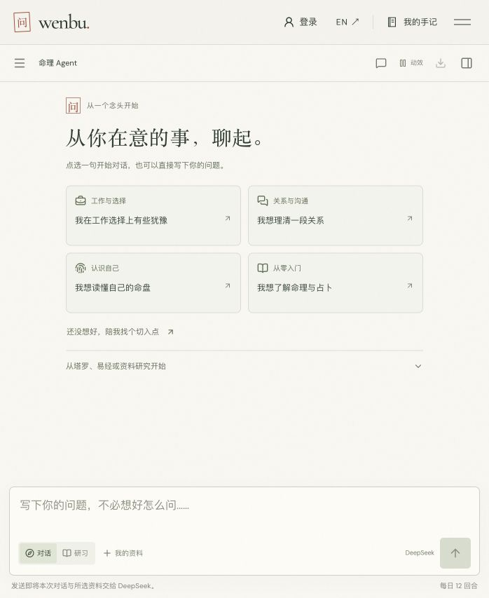
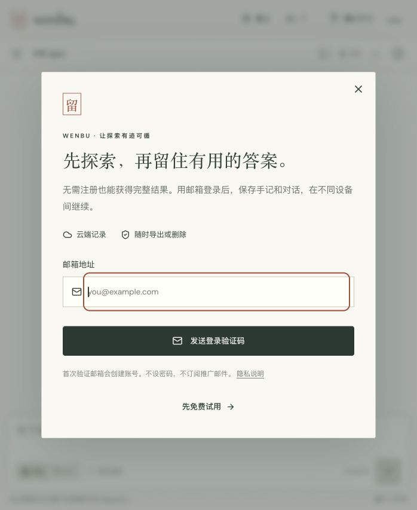
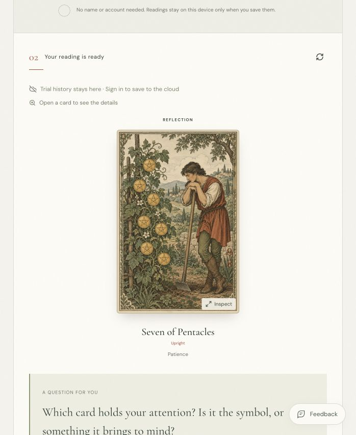
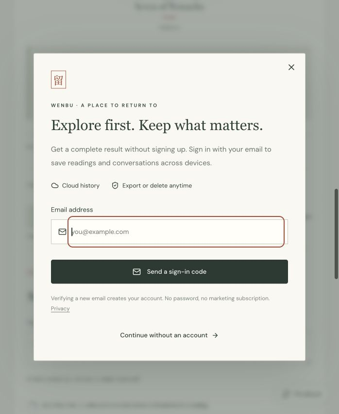
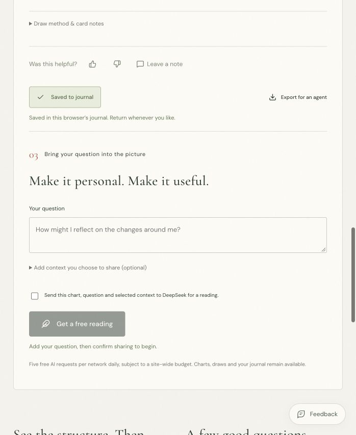

# 注册时机：线上入口检查

日期：2026-10-05。结论：先体验的基础正确；Agent 结果内保存入口、工具保存按钮的预期、定向保存后的返回和提示曝光口径需要加强。[完整研究与实现建议](../../research/registration-timing-2026-10-05.md)。本记录是研究证据，不是发布验收。

代码基线：`d95e716c884f1203c6911247afe8f8113fb01432`。浏览器：Codex IAB，默认视窗约 700 × 853，未调整视窗。中文 Agent、中文账号入口、英文单张塔罗。截图均来自本次实际页面；没有用旧截图代替。

## 1. 中文 Agent 初次进入 — 良好，保存收益的说明偏弱

用户可直接选择开场问题，无账号墙。导航有登录入口。当前视窗下侧栏收起，保存提示没有出现在欢迎区。欢迎区应只补一句可以随后保存，不应增加强制注册步骤。Agent 首次完整结果的主动提示缺失由当前代码核对，本次没有额外生成 Agent 报告。

## 2. 主动点击导航登录 — 良好，可进一步按意图说明

邮箱是唯一初始输入，说明首次验证建号且不订阅推广邮件，提供“先免费试用”。点击后邮箱获得焦点。尚未输入邮箱或发送验证码。视觉上已有清晰聚焦框；截图不能证明完整键盘、屏幕阅读器和对比度合规。

## 3. 英文工具生成完整结果 — 需要改进

无个人问题、无出生资料的单张抽牌成功，得到 Seven of Pentacles。结果顶部为通用“Trial history stays here”与登录保存入口，尚未主动保存时容易被理解成结果已经留存。建议把未保存、浏览器已保存、云端已保存明确区分，并把账号邀请放到自然的结果操作位置。

## 4. 点击 Save reading — 需要改进

先保存浏览器副本，再打开邮箱面板。结果被保留是优点，但按钮没有明确预告账号流程；面板也没有说明刚选中的这张结果。英文说明在此宽度正常换行，标题与退出入口可见。建议使用明确的账号保存按钮和带记录摘要的邮箱面板。

## 5. 选择 Continue without an account — 留存行为良好，焦点需复核

退出后显示 Saved to journal，并明确 Saved in this browser’s journal。原卡牌保持不变，没有重抽；可继续填写问题和生成解读。本次关闭后的辅助树报告焦点回到页面根节点，而保存按钮已经禁用；后续实现应把焦点恢复到可用的结果区域或后续操作，并做键盘验收。

## 检查边界

- 只生成一份无个人输入的合成塔罗结果并保存到浏览器；没有提交 AI 问题、验证码、真实邮箱或云端记录。
- 这次生产浏览器操作可能产生访问与使用事件；没有核验其测试分类，不应把这次操作当成自然增长证据。
- 没有在本轮查询生产注册转化、验证真实邮件入箱、执行 OTP 或跨设备登录。邮箱验证后的返回行为来自代码检查，不能说完整线上注册链路已通过。
- 此默认视窗不是完整移动设备认证；没有覆盖 320px、375px、真实手机键盘、屏幕阅读器、所有浏览器或全部错误状态。
- 仅新增文档和截图，没有运行时修改或部署。建议阈值和频控是待验证的产品决策。
